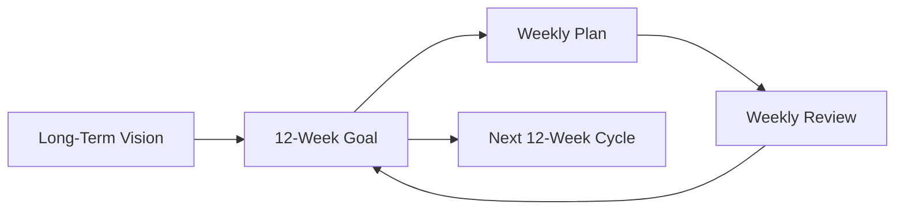

# 12 Week Year

A planning methodology that replaces the annual cycle with four 12-week "years," each treated as a complete performance year.

## The problem with annual planning

Annual plans fail for two structural reasons:

1. **Poor long-horizon prediction** — humans cannot reliably estimate what will unfold over 12 months. Goals set in January are based on assumptions that rarely survive contact with reality.
2. **False abundance of time** — when a goal is 12 months away, the urgency never materialises until Q4. Motivation spikes at New Year, then decays as the year stretches ahead.

The result is a predictable cycle: optimism in January → complacency in spring and summer → anxiety and cramming in Q4.

## The 12-week solution

Compress each "year" to 12 weeks. Run four of these cycles per calendar year.

- The shorter horizon forces prioritisation — you cannot defer everything.
- Goals feel proximate enough to sustain motivation.
- Failure is recoverable: a bad 12-week block costs three months, not a year.

## Planning rhythm

## Key practices

- **Vision alignment** — every 12-week goal must trace back to a [[Vision|long-term vision]]. Without this, the cycle optimises the wrong things.
- **Weekly plans** — break the 12-week goal into weekly milestones. Weekly reviews catch drift early, not at week 11.
- **Treat week 13 as a buffer** — a brief reflection and reset week between cycles, not a spillover period.

## Connected concepts

- [[Goal Setting]] — the mechanism for translating vision into 12-week targets
- [[Vision]] — the north star that 12-week cycles must serve
- [[Think Slow Act Fast]] — plan thoroughly before committing; the 12-week framework is the planning container
- [[Priorities are Time-Bound]] — higher priority = must be done sooner; 12-week compression makes this tangible

See also: [[summaries/12-week-year]] for the book-level summary of Brian Moran's *The 12 Week Year*.
