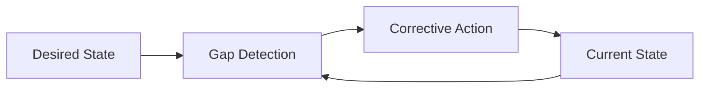

# Balancing Loop

A feedback loop that **resists change and pulls a system toward a desired state** — a self-correcting mechanism. Also called a negative feedback loop.

## Mechanism

A gap between the current state and a target state triggers an action that closes the gap.

## Examples

- High demand depletes inventory → inventory drop triggers a reorder → inventory restored.
- A manager notices burnout in a high-performing employee → provides time off and incentives → performance stabilizes.

## Coexistence with [[Reinforcing Loop]]

A reinforcing loop and a balancing loop often operate on the same system simultaneously. The reinforcing loop drives growth; the balancing loop sets an effective ceiling.

Example: a supportive manager creates a reinforcing loop of rising performance, but unchecked growth leads to burnout. The burnout triggers a balancing loop (manager intervenes with rest/incentives) that maintains performance within sustainable bounds.

See also: [[Systems Thinking]]
