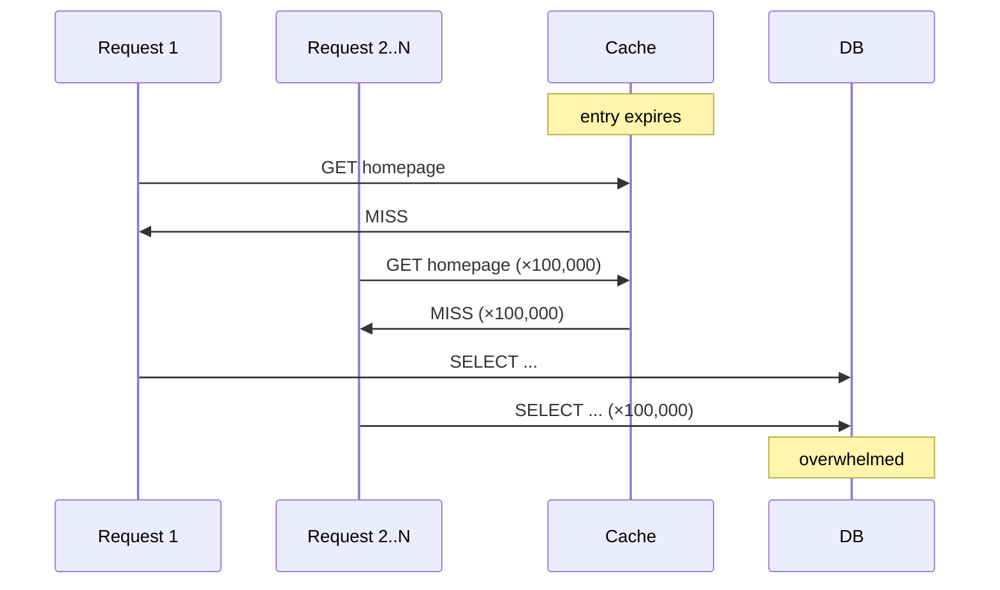
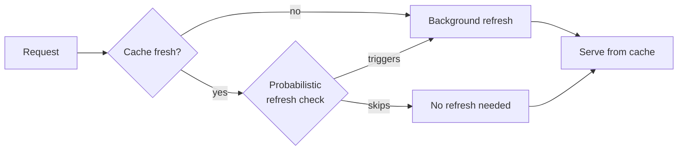

# Cache Stampede

Also called a **thundering herd**. When a popular cached entry expires, every concurrent request that was being served from that cache simultaneously sees a miss and attempts to rebuild the entry from the database — generating a spike of identical expensive queries against a backend that was sized for cached traffic.

A database sized for 1,000 queries/second can be hit with 100,000 identical queries in the same instant. If rebuilding the entry requires expensive joins or external API calls, each of those 100,000 requests pays the full cost.

## Solutions

### Distributed lock (serialize rebuilds)

The first request to see the miss acquires a distributed lock. All other requests for the same key wait on the lock. When the rebuild completes, the lock is released and waiting requests are served from the freshly-populated cache.

**Problem**: if the rebuild fails or times out, all waiting requests fail together. Requires careful timeout and fallback logic — fragile under load.

### Probabilistic Early Refresh

Instead of a hard expiry at T=60min, introduce a probabilistic chance of triggering a background refresh in the window before expiry. The probability increases as the entry ages.

When your entry expires in 60 minutes:
- At minute 50: ~1% chance of refresh on any given request
- At minute 55: ~5% chance
- At minute 59: ~20% chance

A small number of requests trigger background refreshes while the vast majority continue serving the stale-but-still-valid cached data. By the time the hard expiry would have hit, the entry has likely already been refreshed — spreading the rebuild cost across many requests over time rather than concentrating it at one instant.

**Advantage**: no locks, no waiting, no stampede window. Users always get cached data.
**Disadvantage**: requires custom cache client logic; some requests pay a small background cost.

### Background refresh (proactive)

For the most critical cached data, a dedicated background process continuously refreshes entries before they expire — no request ever triggers a rebuild. The homepage cache is updated every 50 minutes; users never see a miss.

**Advantage**: zero stampede risk for covered entries.
**Disadvantage**: infrastructure complexity; wastes work refreshing entries that are never requested between refreshes.

## Comparison

| Approach | Protects DB? | User latency impact | Complexity |
|----------|-------------|---------------------|------------|
| Distributed lock | Yes | Blocking wait on miss | Medium |
| Probabilistic Early Refresh | Yes | None (background) | Medium |
| Background refresh | Yes | None | High |
| None (naive TTL) | No | None (until DB falls over) | None |

## Related

Probabilistic Early Refresh is a specific implementation of this pattern. Background refresh is justified only for the handful of entries where any stampede is unacceptable.

See also: [[Cache Invalidation]], [[Scaling Reads]], [[Redis]], [[concepts/Distributed Systems/index|Distributed Systems]]
