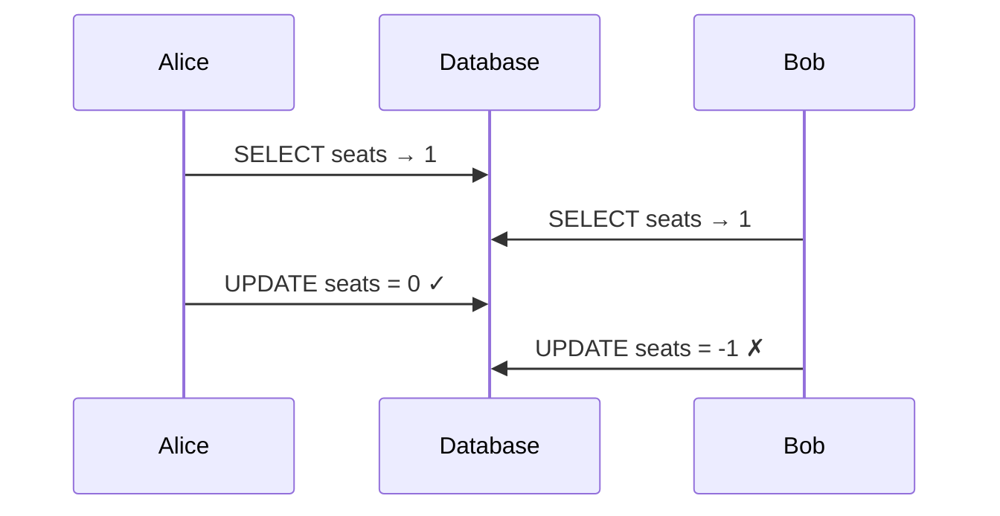
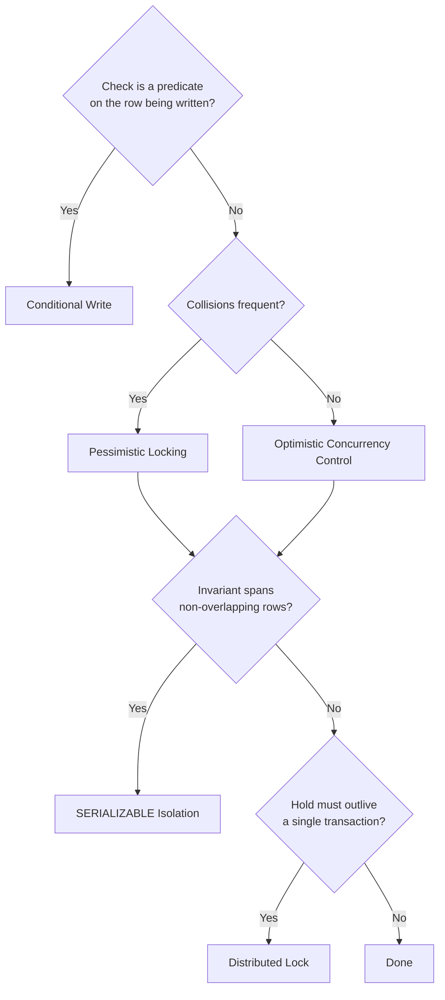

# Dealing with Contention

When multiple clients race to modify the same data, correctness requires closing the gap between reading a value and acting on it. Five tools exist, each suited to a different shape of write.

## The core problem: the lost update

A **race condition** in the read-modify-write pattern: two requests read the same value, both decide to act on it, and both write back — so one silently overwrites the other.

Both Alice and Bob believe they won the seat. Only one is right, but the database doesn't know that.

## Decision tree

## The five tools

| Tool | Use when | Avoid when | Complexity |
|------|----------|------------|------------|
| [[Distributed Systems/Conditional Writes\|Conditional Writes]] | Check is a WHERE predicate | Decision needs app logic | Low |
| [[Distributed Systems/Pessimistic Locking\|Pessimistic Locking]] | Read-decide-write; high contention | Low contention | Low |
| [[Distributed Systems/Optimistic Concurrency Control\|OCC]] | Read-decide-write; rare collisions | High contention → retry storm | Medium |
| [[Distributed Systems/Database Isolation Levels\|SERIALIZABLE]] | Write skew across non-overlapping rows | Hot paths (abort/retry cost) | Medium |
| [[Distributed Systems/Distributed Locks\|Distributed Locks]] | Hold must span wait, external call, or multi-step | Row guard inside one TX covers it | Medium |

## Hot partition (celebrity problem)

When everyone contends on the **same row**, standard scaling stops helping: sharding routes to the same row, load balancing queues on the same database lock, read replicas don't help because the fight is over writes.

Options (pick in order of preference):
1. **Restructure the problem** — 10 identical auction items instead of 1; eventual consistency for social follow counts
2. **Queue-based serialization** — single worker thread per hot resource; turns concurrent contention into a serial queue; caps throughput but eliminates DB lock storms

## Common interview scenarios

| Scenario | Primary tool |
|----------|--------------|
| Last concert ticket | Conditional Write on ticket row (`status = 'available'`) |
| Group seat selection | Pessimistic Locking (`FOR UPDATE` on open seats) |
| Online auction bids | OCC with current high bid as version |
| On-call scheduling | SERIALIZABLE (write skew across engineer rows) |
| Checkout seat hold | Distributed Lock with TTL |
| Bank transfer (single DB) | Pessimistic Locking or OCC |
| Bank transfer (cross-service) | [[Distributed Systems/Distributed Primitives\|Saga Pattern]] |
| Ride dispatch | Distributed Lock on driver status |

See also: [[Distributed Systems/index|Distributed Systems]], [[Distributed Systems/PostgreSQL]]
