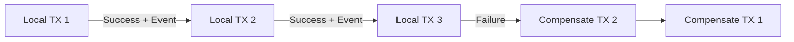

# Distributed Primitives

Core algorithms and patterns used internally by distributed databases and services.

---

## Consistent Hashing

Solves the problem of efficiently distributing keys across nodes when the number of nodes changes.

**The problem with naive hashing**: `hash(key) % N` routes each key to a node. When N changes (add or remove a node), almost every key remaps to a different node — cache invalidation, data migration chaos.

**The solution**: imagine a ring from 0 to M-1. Both keys and servers are hashed to positions on this ring. A key is served by the nearest server clockwise. Adding a server affects only the keys between the new server and its predecessor — minimizing reshuffling.

**Virtual nodes**: if one server goes down, its load concentrates on the next clockwise server. To distribute the load more evenly, use multiple hash functions per server (K virtual nodes per physical server). K×N positions are occupied by servers, spreading the load when any one server drops.

**Key distinction**: virtual nodes prevent *structural imbalance* (uneven key distribution across nodes); replication and key salting prevent *workload imbalance* (uneven request traffic). These are separate problems requiring separate solutions.

**Used by**: Redis (cluster), Cassandra (partitioning), DynamoDB.

---

## Gossip Protocol

Peer-to-peer mechanism for distributing cluster state without a central coordinator.

Each node periodically picks a few other nodes and exchanges metadata: which nodes are alive, schema version, generation (bootstrap timestamp) and version (logical clock incrementing every second). Together these form a vector clock that lets nodes ignore stale information received later.

Properties:
- No single point of failure.
- Eventually consistent cluster-wide view.
- Probabilistic bias toward "seed" nodes to ensure connectivity.

**Used by**: Cassandra (cluster membership, schema propagation, failure detection).

---

## Log Structured Merge Tree (LSM Tree)

Write-optimized storage structure. Cassandra uses this instead of B-tree.

**Three core constructs**:
1. **Commit Log (Write Ahead Log)**: every write is first written sequentially to disk. Ensures durability — if the node crashes before the write reaches memory, the log survives.
2. **Memtable**: in-memory, sorted structure. Accumulates writes, sorted by primary key. Provides fast recent-data lookups.
3. **SSTable (Sorted String Table)**: immutable file on disk. Written when a memtable fills. Read path: check memtable first (most recent), then SSTables newest-to-oldest.

**Compaction**: periodic job that merges SSTables, removes tombstoned (deleted) rows, prevents unbounded growth.

**Read optimizations** (reads are expensive by default — must check memtable, then SSTables newest-to-oldest):
- **Bloom filters**: each SSTable has a bloom filter; if it says "definitely not here," skip that file entirely.
- **Sparse indexes**: SSTables are sorted, so each carries a sparse index of key ranges. Skip any SSTable whose range doesn't overlap the target key.
- **Compaction strategies**: size-tiered compaction batches similar-sized SSTables (good for write-heavy loads but produces more files to check); leveled compaction maintains fewer, non-overlapping files (better reads, more frequent compaction writes).

**Trade-off**: excellent write throughput (mostly sequential); reads may require multiple SSTable scans, mitigated by the above.

---

## Write Ahead Log (WAL)

Sequential, append-only durability mechanism: before modifying any data structure, write the change to the WAL on disk. The write is considered committed once it hits the log.

If the server crashes, the WAL is replayed on restart to recover the state.

Used by: Cassandra (commit log), PostgreSQL (WAL), most ACID databases.

---

## Bloom Filter

Probabilistic data structure that answers "might X be in this set?" with:
- **No** → X is definitely not in the set.
- **Yes** → X might be in the set (false positives possible; false negatives impossible).

Space-efficient and O(1) to query. Used in Cassandra's read path: before scanning an SSTable on disk, check the bloom filter to determine if that SSTable could possibly contain the requested key. Skip SSTables that definitely don't.

*This page is a stub — expand with internals (bit array, multiple hash functions) as more notes are captured.*

---

## Phi Accrual Failure Detector

A probabilistic failure detection algorithm used by Cassandra. Instead of a binary "up/down" decision, it outputs a continuous value φ (phi) representing the suspicion level that a node has failed, based on heartbeat inter-arrival times.

Each node independently decides whether a peer is alive. When φ exceeds a threshold, the peer is "convicted" and writes stop being routed to it. When the node resumes heartbeating, it re-enters the cluster.

**Advantage over fixed timeouts**: adapts to network conditions; reduces false positives from transient slowdowns.

---

## Hinted Handoff

Short-term mechanism to prevent data loss when a write's target node is temporarily offline.

When a coordinator node detects that a target is offline, it stores the write as a "hint" locally. When the target node comes back online, the coordinator delivers the hint.

**Limitations**: hints have a short lifespan. If the node is offline for too long, hints expire and the node must go through read repair to catch up.

---

## Saga Pattern

Manages distributed transactions that span multiple services without requiring a global transaction coordinator.

**The problem**: if you write to a cache and then to a database, and the DB write fails, the cache and DB are now out of sync. Traditional 2PC (two-phase commit) is complex and creates lock contention.

**The solution**: a saga is a sequence of local transactions, each updating one service and publishing an event to trigger the next. If any local transaction fails, compensating transactions are executed in reverse to undo previous steps.

**Trade-off**: no atomicity guarantee across services; compensating transactions must be carefully designed. Eventual consistency.
