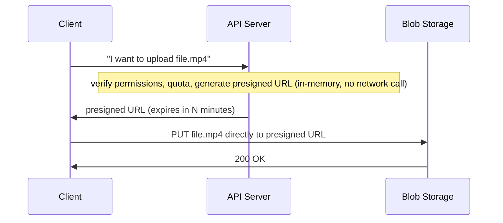
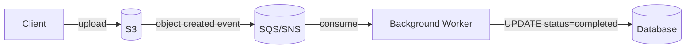

# Handling Large Blobs

Videos, images, and documents need special handling in distributed systems. Routing gigabytes through application servers creates a bottleneck; instead, this pattern uses **presigned URLs** to let clients interact directly with blob storage (S3, GCS, Azure Blob) and download from CDNs. Your servers handle access control and metadata — they never touch the actual bytes.

## Direct upload with presigned URLs

When a client wants to upload a file:

The presigned URL is generated **in-memory** on the API server using your cloud credentials — no network call to the storage service. The signature is a cryptographic hash of the request details (HTTP method, resource path, expiry time) combined with your secret key. The storage service recomputes the same hash when the upload arrives; matching signatures + unexpired URL = upload proceeds.

## Direct download (CDN and blob storage)

Works symmetrically. The client requests a file; the server returns a **signed download URL** granting temporary read access. For CDN delivery, you sign CDN URLs or CDN cookies instead of blob storage URLs — the CDN validates credentials at the edge without touching your origin.

## Resumable uploads (multipart)

All major cloud providers support multipart uploads. S3 splits files into ≥5 MB chunks, each with its own presigned URL:

1. Client initiates the multipart upload → storage returns a **Session ID**
2. Client uploads each part independently (can parallelize)
3. If the connection drops after part 60 of 100, the client resumes from part 61 using the Session ID
4. Client sends a "complete multipart upload" request once all parts are uploaded

This makes large uploads resilient to network failures and enables progress tracking.

## State synchronization

The common pattern stores **file metadata** in your database (status, storage key, owner) while the **actual bytes** live in blob storage. Keeping these in sync is the hard part.

### Problem: trusting the client

The naïve approach: after uploading, the client calls your API to set status = `completed`. This creates several failure modes:

| Failure | Consequence |
|---------|-------------|
| Client crashes after upload but before notification | File exists in S3, database shows `pending` forever (orphaned file) |
| Race condition | Database shows `completed` before file physically exists |
| Malicious client | User marks upload complete without uploading anything |
| Network failure | Completion notification never reaches your server |

### Solution: storage event notifications

Most blob storage services emit events when objects are created (S3 → SNS/SQS, GCS Pub/Sub). Your backend subscribes to these events:

The event includes the object key — the same `storage_key` you stored when generating the presigned URL — so the worker can find the exact database row to update. The storage service itself confirms what exists; the client is no longer in the trust chain.

### Safety net: reconciliation jobs

Events can fail (network issues, processing errors, service outages). Production systems add a periodic reconciliation job that:

1. Queries for files stuck in `pending` status for longer than expected
2. Checks whether each file actually exists in blob storage
3. Updates status or cleans up orphaned records accordingly

This handles the tail of failures that event notifications miss.

## Summary

| Concern | Solution |
|---------|----------|
| Server bandwidth bottleneck | Presigned URL → client uploads/downloads directly |
| Large file resilience | Multipart upload with session ID resumption |
| Progress tracking | Client reports part completion; session ID tracks state |
| Status sync (trusted) | Storage event notifications (SNS/SQS) → background worker |
| Status sync (safety net) | Periodic reconciliation job |

See also: [[Scaling Reads]], [[Cache Invalidation]], [[concepts/Distributed Systems/index|Distributed Systems]]
