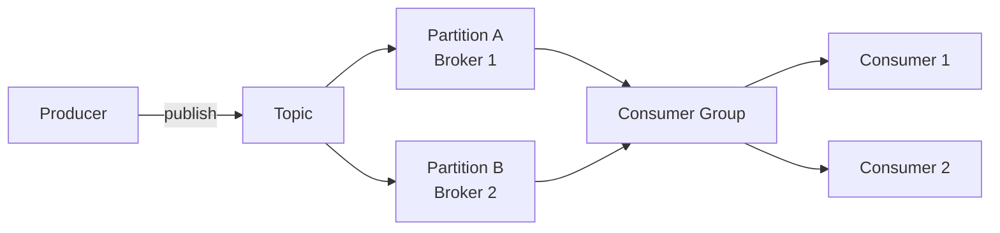

# Kafka

Apache Kafka is a distributed event streaming platform that functions as both a **message queue** and a **stream processing system**. It is built for high-throughput, fault-tolerant, ordered event delivery.

## Core Concepts

| Term | Definition |
|------|-----------|
| **Broker** | An individual server in the Kafka cluster; stores data and serves clients |
| **Topic** | Logical grouping of partitions; the unit of publish/subscribe |
| **Partition** | Ordered, immutable, append-only log; physical unit of parallelism |
| **Producer** | Writes records to a topic |
| **Consumer** | Reads records from a topic |
| **Consumer Group** | Set of consumers that collectively consume a topic; each partition is assigned to exactly one consumer in the group |
| **Offset** | Sequential integer identifying a record's position in a partition; consumers track their own offset |

**Topic vs Partition**: a topic is a *logical* grouping; a partition is a *physical* one. A topic can span many partitions on different brokers. Topics organize data; partitions scale it.

## How Kafka Routes a Message

1. **Producer sends a record** — fields: `key`, `value`, `timestamp`, `headers`
2. **Partition determination** — Kafka hashes the message key to assign a partition. If no key, round-robin (or custom algorithm). Messages with the same key always land in the same partition, preserving order for that key.
3. **Broker assignment** — the Kafka controller maintains partition-to-broker mapping (cluster metadata). The producer reads this metadata and sends directly to the correct broker (the partition leader).
4. **Replication** — the leader writes the record, then replicates it to follower brokers for durability.

Each record receives an **offset** from the partition. Consumers commit offsets to track progress.

## Fault Tolerance and Durability

- Each partition is replicated across multiple brokers (one leader, rest followers).
- **Kafka is always available, sometimes consistent.** It prioritizes availability.
- **Offset management** — if a consumer crashes, it resumes from its last committed offset on restart.
- **Consumer group rebalancing** — when a consumer in a group goes down, Kafka redistributes partitions to surviving consumers.

## Scalability

- Recommended max message size: **1 MB** (no hard limit).
- A single broker can store ~**1 TB** and handle ~**1 M messages/sec**.
- **Scale horizontally** by adding brokers; ensure enough partitions to exploit them (more partitions → more parallelism).
- **Scale a topic** (not the whole cluster) by increasing its partition count when throughput demands it.

### Hot Partitions

A hot partition occurs when one key generates disproportionate load (e.g., Nike launches a viral ad; all clicks hash to the same ad-ID partition).

Mitigations:
| Strategy | Trade-off |
|----------|-----------|
| **No key** (round-robin) | Loses per-key ordering |
| **Random salting** (append random int to key) | Distributes load; loses strict key grouping |
| **Compound key** (e.g., `ad_id + region_id`) | Finer distribution; ordering preserved within the compound key |
| **Back pressure** | Slow down the producer |

## Error Handling and Retries

- **Producer retries** — built-in; configure `retries` and `acks`.
- **Consumer retries** — not built-in. Pattern: move failed messages to a **dead-letter topic** and have a separate consumer process it.

## Performance Optimizations

- **Batching** — send multiple records in a single `send()` call, or use `sendBatch()` across topics. Reduces per-record overhead dramatically.
- **Compression** — enable compression on the producer (e.g., `compress: gzip/lz4/snappy`). Reduces network and storage overhead, especially for repetitive data.

## Retention

By default, Kafka retains messages for **7 days**. Consumers that fall too far behind will miss messages once they age out. Size-based retention can also be configured as an alternative or alongside time-based retention.

## When to Use Kafka in System Design

### As a Message Queue
- Processing that can be **asynchronous** (e.g., YouTube video transcoding — SD is immediate, HD is queued)
- **Ordered processing** (e.g., virtual wait queue for Ticketmaster ticket booking)
- **Decoupling** producers and consumers so they scale independently

### As a Stream Processor
- **Continuous, low-latency processing** (e.g., ad-click aggregation in near-real-time)
- **Fan-out** — same event consumed by multiple consumers simultaneously (e.g., live chat delivered to many subscribers)

## Related Pages

- [[Distributed Systems/Distributed Primitives]] — consistent hashing; LSM trees (Kafka's log storage)
- [[Distributed Systems/Flink]] — often paired with Kafka for stateful stream processing
- [[Distributed Systems/Sharding]] — Kafka partitioning is a form of sharding; hot-partition strategies mirror shard hot-spot strategies
- [[Distributed Systems/System Design Numbers]] — throughput figures for sizing Kafka clusters
