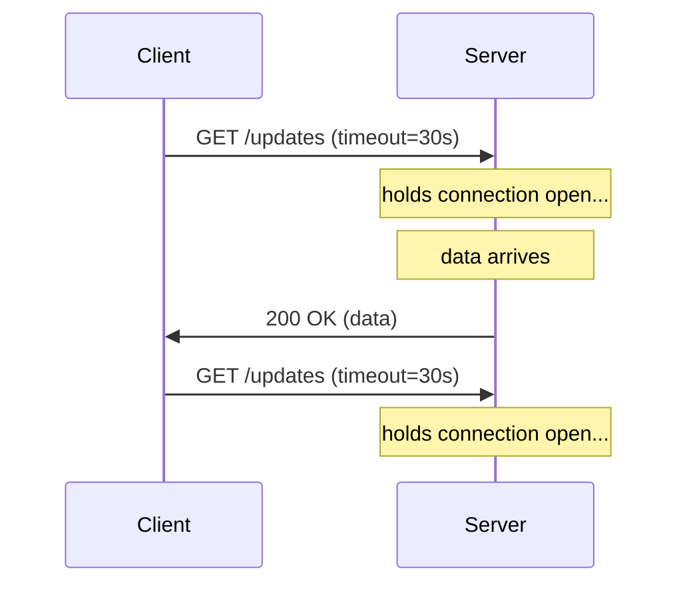

# Long Polling

An upgrade over [[Distributed Systems/Simple Polling]] that reduces latency by having the **server hold the HTTP request open** until new data is available, then respond and let the client immediately re-issue the request.

## How it works

1. Client sends request
2. Server blocks the response until data is ready or a timeout elapses
3. Server sends response; client immediately makes another request

The "call-back" cycle means there is always a small gap between when the server gets new data and when the client actually receives it (the re-request RTT).

## Trade-offs

| | |
|---|---|
| **HTTP compatible** | Builds on standard HTTP; no special infrastructure |
| **Lower latency than simple polling** | Client gets data as soon as it arrives, not at the next interval |
| **Stateless server-side** | No persistent connection state between requests |

| | |
|---|---|
| **Re-request latency** | The round-trip to re-issue the request adds a small lag after each delivery |
| **Server resource pressure** | Held connections consume server threads/file descriptors |
| **Browser connection limits** | Browsers cap concurrent connections per domain; long polling eats into that budget |
| **Monitoring friction** | Long-lived requests look like hangs in dashboards and load-balancer logs |

## When to use

- Updates are infrequent and [[Distributed Systems/Simple Polling]]'s interval latency is unacceptable
- A long async process needs to signal completion as soon as it finishes (e.g. payment processing, job queues)
- Full [[Distributed Systems/WebSockets]] or [[Distributed Systems/Server Sent Events]] infrastructure is impractical

## Comparison

| Mechanism | Latency | Connection state | Complexity |
|---|---|---|---|
| [[Distributed Systems/Simple Polling\|Simple Polling]] | interval-bounded | none | minimal |
| **Long Polling** | low (held until data) | held per request | low |
| [[Distributed Systems/Server Sent Events\|SSE]] | near real-time | persistent (server→client) | low |
| [[Distributed Systems/WebSockets\|WebSockets]] | near real-time | persistent (bidirectional) | medium |

See also: [[Distributed Systems/Real-time Updates]], [[Distributed Systems/index|Distributed Systems]]
