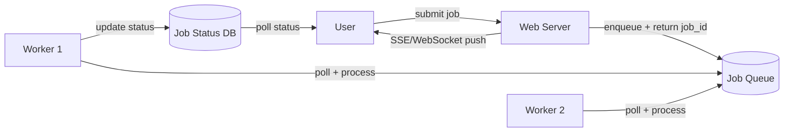

# Managing Long Running Tasks

Splits API requests into two phases: **immediate acknowledgment** and **background processing**. When a user submits a heavy task (video encoding, report generation, file processing), the web server validates the request, pushes a job to a queue, and returns a job ID — all within milliseconds. Separate worker processes poll the queue, execute the work, and update job status.

## The problem

Synchronous request handling works for sub-second operations. It breaks for anything longer:
- Most web servers and load balancers enforce 30–60 second timeouts
- The browser sits on a loading indicator until the response arrives
- A slow task blocks a server thread, reducing capacity for fast requests

## Pattern overview

Web servers become lightweight request routers. Workers scale independently of web servers. Queue depth gives visibility into backlog.

## Trade-offs

**Gains**: fast user response; independent worker scaling; fault isolation (a worker crash doesn't bring down the API); workers can run on hardware optimized for the task (CPU, memory).

**Costs**: system complexity (queues, workers, job status tracking); eventual consistency (data is stale until the job completes); monitoring overhead (queue depth, worker health, failure rates, latency).

## Implementation choices

### Message queues

| Option | When to use |
|--------|-------------|
| Redis + BullMQ | Simple setup; good default for small-medium scale. Redis stores data in memory — risk of loss on crash |
| AWS SQS | Managed; no ops burden; guaranteed delivery. Pay per message |
| RabbitMQ | Complex routing patterns needed; willing to self-host |
| [[Kafka]] | Already using event streaming; need message replay, fan-out, or long retention |

Queue must be **durable** (survives restarts) and support **concurrent access** without duplicate delivery.

### Workers

| Option | Pros | Cons |
|--------|------|------|
| Plain servers | Full control; easy to debug; SSH access | Manual server management; pay for idle capacity |
| Serverless (Lambda) | No server management; auto-scaling; isolated per job | Expensive at spike; 15–60 min execution limit; cold starts |
| Container-based (Kubernetes) | Flexible; orchestrator handles scaling | More complex than plain servers |

## Common deep dives

### Worker crash recovery

Workers register a **heartbeat** with the queue while processing. If the heartbeat stops, the queue assumes the worker is dead and re-queues the job for another worker.

**Heartbeat interval trade-off**:
- Too long → long delay before failed jobs are retried
- Too short → false positives (GC pause mistaken for crash); unnecessary chatter

Each queue has its own mechanism: SQS uses a **visibility timeout**; RabbitMQ has a heartbeat interval; Kafka uses a session timeout. Start at 10–30 seconds for most systems.

### Dead Letter Queue (DLQ)

When a job fails repeatedly (typically 3–5 times), move it to a **Dead Letter Queue** instead of retrying. This:
- Isolates "poison messages" that would crash workers on every attempt
- Lets healthy work continue unblocked
- Creates a collection for human investigation

A growing DLQ is a signal — usually a bug or bad input data. Fix the root cause, then replay the DLQ back to the main queue.

### Idempotency keys

A user clicks "Generate Report" three times impatiently → three identical jobs. Without deduplication, you process the same work three times, send three emails, or charge a card three times.

**Solution**: require a unique **idempotency key** per job. Before creating a new job, check whether a job with that key already exists. If it does, return the existing job ID.

Key construction: `user_id + action + timestamp_rounded_to_window` for user-initiated actions; deterministic hash of input data for system-generated jobs.

Also make the **work itself idempotent**: check whether an email was already sent or a file already processed before proceeding — safe to retry a partially-completed job.

### Queue backpressure

When workers can't keep up (e.g. Black Friday), the queue grows unbounded. Memory explodes; job wait times stretch to hours; new jobs get rejected.

**Solutions**:
- Set a **queue depth limit** and return "system busy" immediately when the queue is full (fail fast rather than accepting unprocessable work)
- **Autoscale workers** based on queue depth — when depth exceeds a threshold, spin up more workers; scale down when it shrinks. Queue depth is the right signal, not CPU (by the time CPU is high, the queue is already backed up)

### Mixed workloads (head-of-line blocking)

5-second PDF reports and 5-hour year-end exports in the same queue: long jobs block short ones; autoscaling signals become noisy.

**Solution**: separate queues by job duration or type. Fast queue → many lightweight workers. Slow queue → fewer, beefier workers. Tune each queue independently.

If duration can't be predicted upfront: start jobs in the fast queue; move them to the slow queue if they exceed a time threshold.

Alternatively, **chunk large jobs** into smaller pieces that use the same queue (e.g., split a news feed fanout into batches of followers).

### Job dependency orchestration

A report requires three sequential steps: fetch data → generate PDF → email. Without coordination, workers queue the next step themselves — spaghetti code, opaque failure handling.

**Simple chains**: each worker queues the next job before marking itself complete. Include full context in each job so steps can be retried independently.

**Complex workflows** (branching, parallel steps): use a **workflow orchestrator** — AWS Step Functions, Temporal, or Airflow. These define workflows as code, handle per-step retries, and provide visibility into where workflows stall.

See also: [[Kafka]], [[Redis]], [[Server Sent Events]], [[WebSockets]], [[concepts/Distributed Systems/index|Distributed Systems]]
