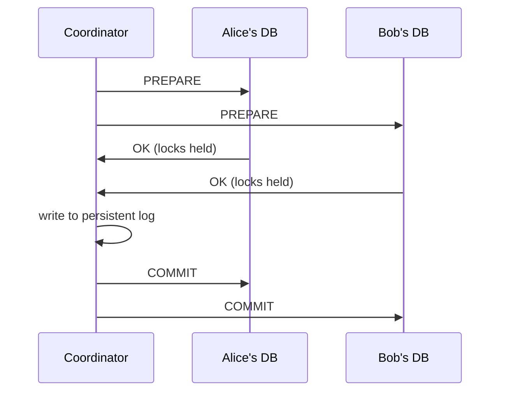
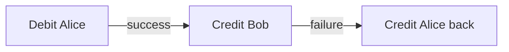
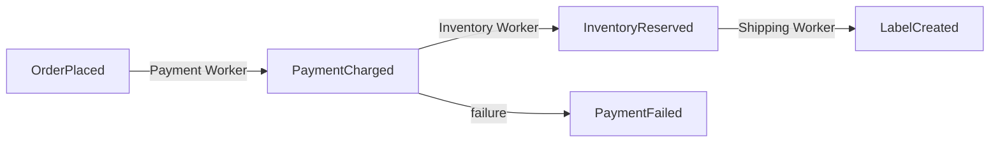

# Multi-step Processes

Real production systems must survive failures, retries, and long-running operations spanning hours or days. When a user action fans out across multiple services — payment gateway, inventory, shipping, email — each step can fail independently, and the system must recover gracefully.

**Example flow**: Charge payment → Reserve inventory → Create label → Pick and pack → Send confirmation → Wait for pickup

Each step has distinct failure modes: payment gateway latency, inventory exhaustion requiring a refund, label machine outage, email delivery failure requiring retry.

## Approach 1 — Distributed transactions (2PC)

### Two-Phase Commit (2PC)

A **coordinator** (your service) manages a transaction across multiple database participants:

1. **Prepare phase**: coordinator asks all participants to prepare (do all the work except the final commit, hold locks)
2. **Commit/abort phase**: if all participants prepared successfully, coordinator tells them all to commit; otherwise abort

**Critical**: the coordinator must write to a **persistent log** before sending commit/abort. Without it, a coordinator crash leaves participants holding locks forever, waiting for a decision that may never come.

**Weakness**: prepare phase holds locks across a network boundary. If the coordinator crashes between prepare and commit, participants block until the coordinator recovers. This makes 2PC sensitive to coordinator availability and latency.

### Saga Pattern

Instead of one atomic distributed transaction, break the operation into **independent committed steps**, each of which has a **compensating transaction** that undoes it.

Each transaction commits immediately — no locks held across services. If a later step fails, compensating transactions run in reverse to restore consistency.

**Trade-off**: during execution, the system is **temporarily inconsistent**. Between debit and credit, Alice's account shows the debit but Bob hasn't been credited yet. Applications must be designed to handle these intermediate states. See also: [[Distributed Primitives]] for a brief overview.

**2PC vs Saga**:

| | 2PC | Saga |
|---|---|---|
| Consistency | Atomic (all-or-nothing) | Eventual (temporary inconsistency) |
| Locks | Held across all participants | None (each step commits independently) |
| Failure impact | Participants block on coordinator crash | Compensation runs; no blocking |
| Complexity | Simple coordinator logic | Must design compensating transactions |

## Approach 2 — Single server orchestration

One server calls each service sequentially. Simple for low-reliability requirements.

**Problem**: if the server crashes after step 2 of 5, it has no memory of where it was. Adding state persistence to the database and pub/sub for callbacks helps, but introduces new issues:
- Multiple API servers competing to pick up dropped work
- Compensation logic (refund payment if inventory fails) lives scattered across application code

## Approach 3 — Event sourcing

Store the **sequence of events** rather than current state, using a durable log ([[Kafka]], Redis Streams). Each worker consumes events and emits new ones.

If a worker crashes mid-step, it re-reads the event log and resumes. The log is the single source of truth for system state.

**Difference from EDA**: Event-Driven Architecture decouples services via events; event sourcing uses event replay to reconstruct state and increase robustness.

## Approach 4 — Workflow engines

### Durable execution (Temporal)

Write a **regular function** representing the workflow; the engine guarantees it survives failures by checkpointing state after each step. When a worker crashes, the workflow replays from the last checkpoint on a new worker — activities that already completed are not re-executed.

Two primitives:
- **Workflows** — high-level orchestration code; must be **deterministic** (timestamps fixed, random numbers reproducible) to enable replay-based recovery
- **Activities** — individual steps; must be **idempotent** since the engine guarantees at-least-once delivery

### Managed workflow systems (Step Functions, Airflow, GCP Workflows)

Define workflows as **state machines** in JSON/YAML/DSL instead of code. Provides a nicer UI and built-in visualization; less expressive for complex branching logic.

## Common deep dives

### Coordinator crash in 2PC

Participants hold prepared locks indefinitely if the coordinator crashes mid-transaction. Recovery: the new coordinator reads the persistent log and resolves in-flight transactions. Requires coordinator high availability (leader election, fast failover).

Sagas are more resilient: coordinator failure merely pauses progress instead of leaving participants in limbo. A workflow engine gives this durability for free.

### Updating a running workflow

10,000 loan approval workflows are running. You need to add a compliance check. Options:

**Versioning**: deploy workflows tagged with a new version; old workflows continue on the old version until they complete. Simple, but the new check doesn't apply to in-flight workflows.

**Patches** (Temporal): a `patch()` call makes the engine decide deterministically which code path to follow per execution — workflows that have already passed the patched branch follow the legacy path; new workflows follow the updated path.

**Declarative systems**: update the workflow definition in place; the engine handles state migration.

### Workflow state size

Temporal persists the full execution history for replay. Long-running workflows accumulate large histories.

**Mitigations**:
- Pass identifiers (e.g., order IDs) rather than full payloads into activities; look up data in a database instead
- Periodically **recreate** the workflow from scratch, passing only required inputs to the new instance ("continue-as-new" pattern)

### Waiting for external events

A workflow waits for a customer to sign documents — could be 5 minutes or 5 days.

**Solution: signals**. The workflow suspends; external systems deliver a signal via the workflow engine's API when the event occurs. No polling, no resource consumption while waiting.

### Exactly-once activity execution

Workflow engines guarantee **at-least-once** delivery. If an activity completes but fails to ack, it will be retried.

For non-idempotent side effects (charge a card, send an email), use **idempotency keys**: store the key to a database before executing the action; check for the key's existence at the start of each retry. If the key exists, skip the action and return the previous result.

See also: [[Managing Long Running Tasks]], [[Distributed Primitives]], [[Kafka]], [[concepts/Distributed Systems/index|Distributed Systems]]
