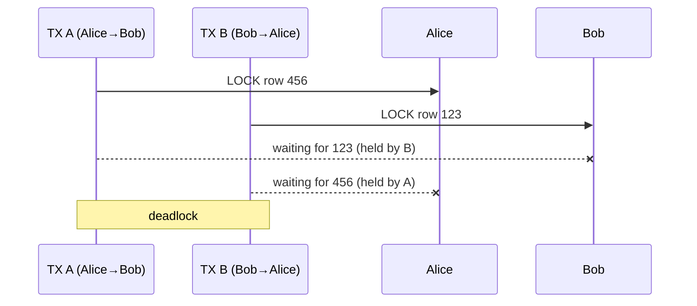

# Pessimistic Locking

A concurrency strategy that **prevents conflicts by acquiring locks before acting**. Named "pessimistic" because it assumes collisions will happen and blocks others proactively, rather than detecting conflicts after the fact.

Use when the decision about which rows to write runs in application code between the read and the write — a predicate that can't be expressed in a single `WHERE` clause.

## Pattern

```sql
BEGIN TRANSACTION;

-- Lock the rows we're about to decide on
SELECT seat_number FROM seats
WHERE concert_id = 'weeknd_tour'
  AND section = 'floor'
  AND status = 'available'
FOR UPDATE;

-- Application scans result, finds A15–A18 open and adjacent, then claims them
UPDATE seats
SET status = 'sold', user_id = 'user123'
WHERE concert_id = 'weeknd_tour'
  AND seat_number IN ('A15', 'A16', 'A17', 'A18');

COMMIT;
```

`FOR UPDATE` locks every row the `SELECT` returns. A second group running the same query waits until the first commits. By then A15–A18 are sold and drop out of the available set — no seat sold twice.

## When to use vs. conditional writes

| Situation | Tool |
|-----------|------|
| Guard is a WHERE predicate | [[Conditional Writes\|Conditional Write]] |
| Decision runs in app code (block of seats, balance check across rows) | Pessimistic Locking |

If your logic can be simplified back to a WHERE predicate, drop the lock — don't pay for what you don't need.

## Common failure modes

### Locking too much, for too long

A lock only buys safety for the rows it covers and the time it's held. Lock an entire table and every writer serializes. Hold a lock across a payment API call and every other buyer of that concert waits on a third party's latency.

- Do slow I/O (external API calls, user interaction) **before acquiring the lock or after releasing it**
- Scope the lock to the smallest set of rows needed
- Release as soon as the write is committed

### Deadlocks from inconsistent ordering

Two transactions that acquire the same rows in opposite orders deadlock — each holds one lock waiting on the other.



**Fix: always acquire locks in a consistent sorted order** (e.g., by primary key ascending). If a transfer touches users 123 and 456, always lock 123 first regardless of who initiated the transfer. Both transactions follow the same ordering — the cycle can't form.

Even with ordered locking, treat deadlock as a retryable error. Every major database runs automatic deadlock detection and aborts one transaction with a deadlock error; the loser retries.

## Cost

Every transaction pays the locking overhead, including the majority that would never have collided with anyone. This is the premium for an insurance policy most buyers don't need. When collisions are rare, [[Optimistic Concurrency Control|OCC]] is cheaper — it pays only on actual collision.

See also: [[Dealing with Contention]], [[Optimistic Concurrency Control]], [[concepts/Distributed Systems/index|Distributed Systems]]
