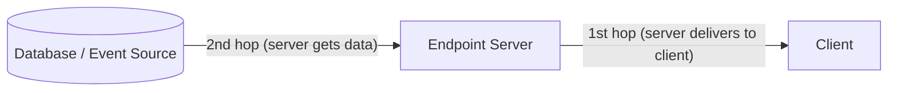
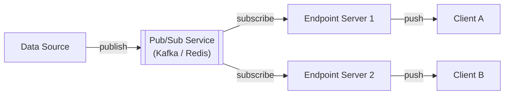
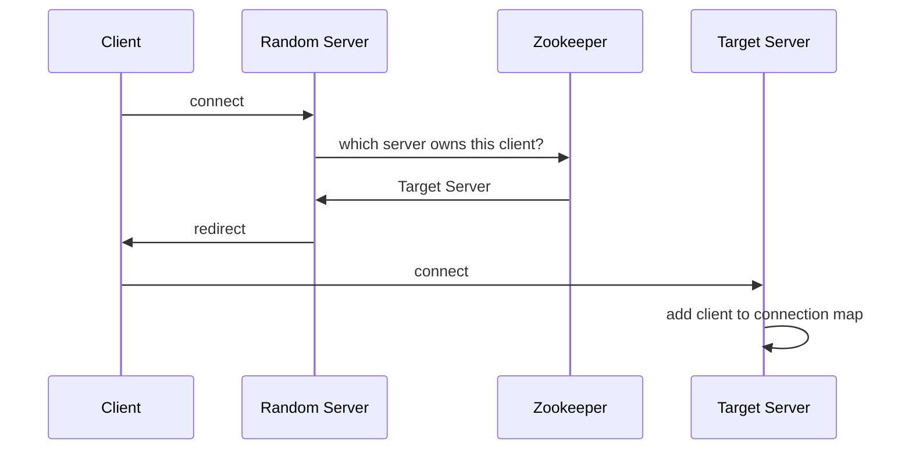

# Real-time Updates

Pattern for delivering data from server to client with minimal latency. Required in chat apps, live dashboards, metrics, collaborative editing, live scores, and streaming.

## The two hops

Every real-time system has two legs:

**1st hop** — how the server delivers updates to clients. Five mechanisms, each with distinct trade-offs.

**2nd hop** — how the server learns about new data to push. Two main approaches: pulling via simple polling or being pushed via pub/sub.

## 1st hop: client delivery mechanisms

| Mechanism | Direction | Connection | Best for |
|---|---|---|---|
| [[Simple Polling\|Simple Polling]] | pull | stateless | low-frequency, simple setup |
| [[Long Polling\|Long Polling]] | pull-held | per-request | infrequent updates, async job completion |
| [[Server Sent Events\|SSE]] | server→client | persistent | one-way push (notifications, AI streaming) |
| [[WebSockets\|WebSockets]] | bidirectional | persistent | interactive real-time (chat, gaming) |
| [[WebRTC\|WebRTC]] | peer-to-peer | persistent | audio/video, low-latency P2P |

Choose the simplest mechanism that satisfies latency and interaction requirements. WebSockets are not always better — SSE is sufficient for one-way feeds and is far easier to operate.

## 2nd hop: how the server gets data

### Pulling with simple polling

The server queries the database each time a client poll arrives. No separate trigger mechanism — the client's request itself acts as the trigger. Simple but creates database read amplification proportional to client count × poll frequency.

### Pushing via pub/sub

A pub/sub service (e.g. [[Kafka|Kafka]], [[Redis|Redis]] Pub/Sub) fans out updates to endpoint servers, which then forward to their connected clients.

Clients connect to any endpoint server; the endpoint registers a subscription for the client's topics. The pub/sub layer handles fan-out and deduplication.

**Advantages**: simple load balancing ("least connections" works); easy horizontal scaling; stateful connection is isolated to the edge.

**Disadvantages**: pub/sub becomes a bottleneck and single point of failure; many-to-many connections between pub/sub hosts and endpoint servers add latency; endpoint doesn't know a client's connection state.

### Pushing via consistent hashing

For protocols that maintain a persistent connection per client (long polling, SSE, WebSockets), the endpoint server holding that connection must be the one that delivers the update. Two strategies:

**Modulo hashing** — `server_index = hash(user_id) % N`. Deterministic assignment; simple to implement. Scaling N disrupts all existing assignments.

**Consistent hashing** — nodes on a ring; only `1/N` of connections are remapped when N changes. Requires a coordination service (e.g. [[Zookeeper|Zookeeper]], etcd) that all servers query to determine routing.

Connection flow with consistent hashing:

Scaling events require coordinated migration: record old and new assignments, slowly reconnect clients, duplicate messages to both servers during transition.

## Common system design deep dives

### Connection failures and reconnection

Networks are unreliable — mobile clients drop constantly. Key challenges:

- **Zombie detection**: WebSocket connections don't always signal breaks; implement heartbeat/ping frames to detect stale connections quickly
- **Message recovery**: assign sequence numbers or use stream offsets (Redis Streams, Kafka offsets) so reconnecting clients can request missed messages
- **Idempotency**: delivering the same message twice is safer than losing it; design consumers to be idempotent

### The celebrity problem (fan-out at scale)

When a celebrity posts, millions of clients need the same update simultaneously. Naive per-user fan-out collapses the pub/sub layer.

- Cache the update once; distribute hierarchically through regional tiers
- Consider "pull on connect" for very popular entities — clients pull current state when they connect and only stream deltas after
- Pre-compute aggregated feeds for power users; real-time deltas are small

### Message ordering across distributed servers

Two messages sent milliseconds apart may arrive out of order via different network paths.

- **Vector clocks / logical timestamps**: each message carries a logical timestamp; recipients reorder before delivering to the application
- **Single writer per partition**: route all messages for a given entity/room through one server or Kafka partition; sacrifices some scalability for ordering guarantees
- **Client-side ordering buffer**: hold messages for a short window and reorder before rendering; hides network jitter at the cost of a small added latency

See also: [[concepts/Distributed Systems/index|Distributed Systems]]
