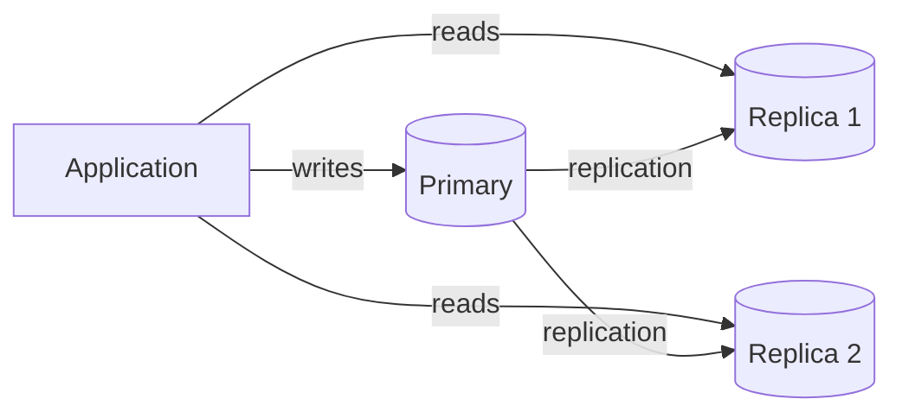

# Scaling Reads

Web services typically receive far more read traffic than write traffic — ratios start at 10:1 and can reach 1000:1 at scale. Three progressive strategies address this, applied in order as traffic grows.

## Strategy 1 — Optimize reads within the database

Most read scaling problems are solvable by tuning the database before adding infrastructure.

### Indexes

Add indexes on every column used in frequent `WHERE` and `JOIN` clauses. A missing index on a 10M-row table turns a millisecond lookup into a 30-second full table scan. See [[Database Indexing]].

**Compound index column order matters**: an index on `(status, created_at)` helps queries filtering by `status` alone or by both columns — but not queries filtering only by `created_at`.

### Hardware upgrades

- HDD → SSD: 10–100× I/O improvement
- More RAM → larger buffer pool, more hot data stays in memory
- More CPU → more parallel query execution

### Denormalization

Normalization eliminates redundancy but forces expensive joins. For read-heavy workloads, **pre-joining related data** into a single wide table or materialized view reduces complex queries to simple lookups, at the cost of update complexity and storage.

Apply selectively: denormalize hot read paths, keep writes normalized.

## Strategy 2 — Scale the database horizontally

Scale horizontally when read requests consistently exceed ~50–100k requests per second.

### Read replicas

All writes go to the primary. Reads distribute across replicas.

Key challenge: **replication lag** — a replica may serve stale data for milliseconds to seconds after a write commits on the primary. Design read-after-write flows to account for this (e.g., read from primary immediately after a user's own write).

Replica promotion provides automatic failover if the primary fails.

### Sharding

Read replicas distribute load but don't reduce table size — a slow query on a 10TB table is still slow on a replica. Sharding partitions the data itself across multiple nodes. See [[Sharding]].

- **Functional sharding** — split by business domain (users table on shard A, orders table on shard B)
- **Geographical sharding** — split by user location (EU data on EU shard)

## Strategy 3 — Add external caching layers

When read traffic is so disproportionate that even replicated databases can't keep up (e.g., millions of users reading the same viral post), caching stores frequently accessed results in memory for sub-millisecond responses.

### Application-level caching (Redis)

An in-memory store ([[Redis]]) sits between the application and database. On a read, the application checks the cache first; on a miss, it reads the database and writes the result back to cache.

**Cache invalidation strategies**:

| Strategy | How it works | Trade-off |
|----------|--------------|-----------|
| TTL | Entry expires after a fixed time | Simple; may serve stale data until expiry |
| Write-through | Delete/update cache immediately on DB write | Consistent; adds write latency |
| Write-behind | Queue invalidation events asynchronously | Low write latency; brief stale window |
| Tagged invalidation | Group entries by tag; delete all entries for a tag on update | Flexible; requires tag management |
| Cache key versioning | Include version number in key; increment on write | No race conditions; stale entries expire naturally |

See [[Cache Invalidation]] for a deeper treatment of each.

### CDN and edge caching

A CDN caches responses geographically close to users. A request from Sydney hits an edge node in Sydney instead of a data center in Virginia, reducing latency by 100–200ms.

Critical updates may bypass CDN caching entirely (via `Cache-Control: no-store`), trading performance for consistency.

## Common deep dives

### Hot key problem

When millions of users request the same cache key simultaneously (a celebrity's post), the cache server itself becomes the bottleneck even though the data is in memory.

**Solutions**:
- **Request coalescing** — collapse concurrent requests for the same key into one backend fetch; others wait for the result
- **Cache key fanout** — store identical copies under multiple keys (e.g., `feed:taylor:1` through `feed:taylor:10`); each client picks one randomly, spreading 500k req/s across 10 keys at 50k each

### Cache stampede

When a popular cache entry expires, all concurrent readers simultaneously see a miss and attempt to rebuild from the database — a self-inflicted spike. See [[Cache Stampede]].

### Queries taking longer as dataset grows

Full table scans that were fast at 10k rows become painfully slow at 10M. Compound joins multiply the problem. The fix is almost always proper indexing; see [[Database Indexing]].

See also: [[Redis]], [[Sharding]], [[Database Indexing]], [[concepts/Distributed Systems/index|Distributed Systems]]
