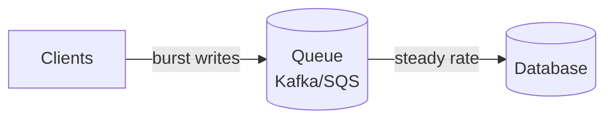

# Scaling Writes

Scaling Writes addresses the challenge of handling high-volume write operations when a single database becomes the bottleneck on disk I/O, CPU, or network bandwidth. Four strategies applied progressively.

## Strategy 1 — Vertical scaling and write-optimized databases

### Vertical scaling

Get bigger hardware first — NVMe SSDs, more RAM, more CPU cores. Often sufficient and the cheapest option. See [[System Design Numbers]] for reference throughput figures.

### Write-optimized database choices

If writes consistently outpace reads (or reads can tolerate latency), consider purpose-built write-optimized stores:

| Database type | Examples | Why it helps |
|---|---|---|
| Write-optimized wide-column | [[Cassandra]] | LSM tree: writes are sequential appends, not random seeks |
| Timeseries | InfluxDB, TimescaleDB | Built for high-volume sequential timestamp-keyed writes |
| Log-structured | Many embedded DBs | Appends new records instead of in-place updates |
| Column-oriented | ClickHouse | Batch writes efficiently compressed; analytics workloads |

## Strategy 2 — Sharding and partitioning

### Horizontal sharding

Distribute rows across multiple database nodes. Each write goes to the shard responsible for that row's key. See [[Sharding]] for key selection and strategies.

**Partition key selection**: choose a key that distributes writes evenly. Ask: "how many shards does this request hit?" and "how often does it happen?" A bad key creates hot shards that absorb disproportionate traffic.

Redis uses consistent hashing — each key maps to a hash slot, and hash slots are assigned to nodes. See [[Distributed Primitives]] for consistent hashing internals.

### Vertical partitioning

Split a wide table by columns rather than rows. A `posts` table might be split into:
- `post_content` — B-tree indexed, optimized for reads
- `post_metrics` — in-memory or counter-optimized, for high-frequency like/view increments
- `post_analytics` — column-store or time-series optimized, for aggregation queries

Once logically separated, each partition can move to a different physical database instance tuned for its access pattern.

## Strategy 3 — Queues and load shedding

### Write queues for burst absorption

Use a message queue ([[Kafka]], SQS) to decouple the ingest rate from the database write rate. When traffic spikes, the queue absorbs the burst; the database consumes at a steady pace.

**Trade-off**: writes are acknowledged before they reach the database. Define tolerance for write delay and stale reads at the requirements stage.

### Load shedding

Drop lower-value writes when the system is overloaded. Works for data where freshness makes older values worthless:

- Location tracking (Uber, Strava) — users send GPS positions every few seconds; dropping one write is harmless because the next position arrives almost immediately and is more current
- Metrics counters — approximate counts are acceptable; precise counts are not worth availability

Load shedding does **not** work for writes that must be durable (payment records, orders).

## Strategy 4 — Batching and hierarchical aggregation

### Batching

Group multiple writes into a single database operation. Databases handle batch writes far more efficiently than the same volume of individual writes.

| Layer | Mechanism |
|---|---|
| Application | Client accumulates writes in memory and flushes periodically |
| Intermediate | A dedicated aggregator service batches writes before forwarding to DB |
| Database | Configurable flush interval (e.g., Redis defaults to flushing to disk every 100ms — 1,000 writes in that window become one disk I/O) |

**Trade-off**: a crash between batch accumulation and flush loses all unflushed writes. Size batches based on acceptable data-loss window.

### Hierarchical aggregation

When millions of clients are writing the same eventually-consistent aggregate (live stream likes, comment counts), fan-out to all clients is unnecessary. Instead:

1. Assign clients to **broadcast nodes** via [[Distributed Primitives|consistent hashing]]
2. Writes flow to broadcast nodes, not to all clients
3. Each broadcast node forwards updates only to its assigned clients

This reduces fan-out from O(viewers) to O(broadcast_nodes × clients_per_node).

## Common deep dives

### Resharding without downtime

Naive approach: take the system offline, rehash all data, redistribute. Unacceptable for production.

**Gradual migration**:
1. Mark the shard to split; dual-write new data to both old and new shard
2. Migrate existing data in the background at a controlled rate
3. Once backfill completes, cut reads over to the new shard
4. Drain the old shard and decommission

### Hot key problem (write equivalent)

A single key (viral tweet, flash sale item) receives far more writes than any shard can handle — even dedicating an entire shard to it isn't enough.

**Option A — Static key fanout**: split all keys into `k` sub-keys (`post1Likes-0` through `post1Likes-k-1`). Writes distribute across k shards. Reads must aggregate all k sub-keys.

- ✓ Simple, predictable
- ✗ `k` times more storage; read amplification by k

**Option B — Dynamic hot key splitting**: detect hot keys by monitoring write rate. When a key crosses a threshold, split it dynamically into sub-keys.

- Readers always scan all sub-keys (same amplification, but only for detected hot keys)
- Or: writers announce the split to readers before executing it (lower amplification, higher implementation complexity)

Both approaches work for **aggregatable metrics** (counts, sums, balances). They do not work for **atomic data** (user profiles, configuration), which is rarely under the same write pressure.

See also: [[Sharding]], [[Cassandra]], [[Kafka]], [[Distributed Primitives]], [[Scaling Reads]], [[concepts/Distributed Systems/index|Distributed Systems]]
