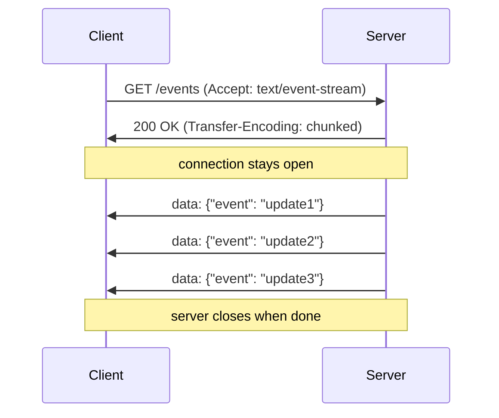

# Server Sent Events (SSE)

An extension of [[Long Polling]] that establishes a **persistent HTTP connection** through which the server streams a sequence of events to the client. Unlike long polling, there is no re-request cycle — the connection stays open and the server sends chunks as data becomes available.

## How it works

Standard HTTP responses include a `Content-Length` header. SSE uses `Transfer-Encoding: chunked` instead, signaling that the response is an open-ended series of chunks whose count and size are not known in advance.

1. Client establishes the connection with `Accept: text/event-stream`
2. Server keeps the connection open and pushes messages as newline-delimited event records
3. Browser has built-in SSE support and handles automatic reconnection

## Trade-offs

| | |
|---|---|
| **Browser-native** | The `EventSource` API is built into all modern browsers; no libraries needed |
| **HTTP based** | Works through standard HTTP proxies and infrastructure |
| **Efficient** | One connection for many events; no per-event connection setup like polling |
| **Auto-reconnect** | Browser automatically reconnects after disconnection with `Last-Event-ID` resumption |

| | |
|---|---|
| **One-way only** | Server → client only; client cannot send messages on the same connection |
| **Proxy issues** | Some older proxies and network equipment buffer chunks, breaking the stream |
| **Connection limits** | Browsers cap concurrent connections per domain; SSE connections eat into that budget |
| **Monitoring friction** | Long-lived requests appear as hung requests in dashboards and load balancers |

## When to use

- Notifications or feeds where the **client does not need to send data back** (unidirectional push)
- AI chat streaming (token-by-token response streaming)
- News tickers, live score updates, server log tails
- Scenarios where WebSocket infrastructure is too heavy but polling is too wasteful

## SSE vs alternatives

| Mechanism | Direction | Persistent | Native browser API |
|---|---|---|---|
| [[Simple Polling\|Simple Polling]] | client→server (pull) | no | yes (fetch) |
| [[Long Polling\|Long Polling]] | server→client (pull-held) | per request | yes (fetch) |
| **SSE** | server→client only | yes | yes (EventSource) |
| [[WebSockets\|WebSockets]] | bidirectional | yes | yes (WebSocket) |
| [[WebRTC\|WebRTC]] | peer-to-peer | yes | yes (RTCPeerConnection) |

See also: [[Real-time Updates]], [[concepts/Distributed Systems/index|Distributed Systems]]
