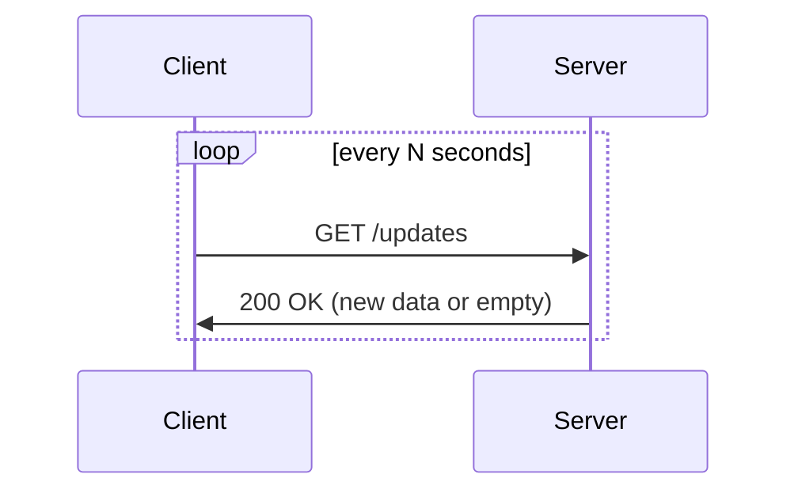

# Simple Polling

The baseline real-time update mechanism. The client issues a standard HTTP request to the server on a **fixed interval** to check for new data.

## How it works

Each poll is an independent, stateless HTTP request. The server responds immediately with whatever data is currently available.

## Trade-offs

| | |
|---|---|
| **Simplicity** | No special infrastructure; works with any HTTP stack |
| **Statelesness** | Server holds no per-client connection state |
| **Compatibility** | Works through every proxy and load balancer |

| | |
|---|---|
| **Latency** | Updates are delayed up to the polling interval plus processing time |
| **Bandwidth** | Every poll incurs a full HTTP round-trip regardless of whether there is new data |
| **Server load** | With many clients, connection-establishment overhead compounds; load scales linearly with client count × poll frequency |

## When to use

- Data freshness requirements are loose (seconds or minutes of lag is acceptable)
- Implementation simplicity outweighs bandwidth cost
- The polling interval can be tuned to roughly match the update rate

## Comparison

| Mechanism | Latency | Connection state | Complexity |
|---|---|---|---|
| **Simple Polling** | interval-bounded | none | minimal |
| [[Long Polling\|Long Polling]] | lower (held until data ready) | held open | low |
| [[Server Sent Events\|SSE]] | near real-time | persistent (server→client) | low |
| [[WebSockets\|WebSockets]] | near real-time | persistent (bidirectional) | medium |
| [[WebRTC\|WebRTC]] | near real-time | peer-to-peer | high |

See also: [[Real-time Updates]], [[concepts/Distributed Systems/index|Distributed Systems]]
