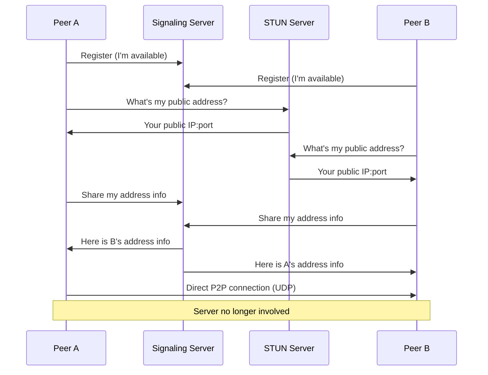

# WebRTC

**Web Real-Time Communication** — a standard for direct **peer-to-peer (P2P) communication** between browsers (or other clients) without requiring a server to relay data. The only major browser protocol that uses **UDP** instead of TCP.

## Use cases

- Video/audio calling and conferencing (Google Meet, Zoom)
- Real-time collaborative document editing
- P2P file sharing
- Low-latency multiplayer gaming

## The NAT problem

Most clients are behind NAT devices that block unsolicited inbound traffic. Two peers cannot simply connect to each other's IP addresses. WebRTC defines two mechanisms to work around this:

**STUN** (Session Traversal Utilities for NAT) — a protocol that lets a client discover its own publicly routable IP address and port as seen from outside the NAT. The client repeatedly creates open ports and shares them with peers via a signaling server.

**TURN** (Traversal Using Relays around NAT) — a relay fallback. When direct P2P fails (e.g., symmetric NAT), traffic is routed through a TURN server which forwards it to the destination peer.

## Connection sequence

If the direct connection fails → both peers connect via TURN relay server instead.

## Architecture components

| Component | Role | Required for data? |
|---|---|---|
| Signaling server | Peer discovery and address exchange | Setup only |
| STUN server | NAT traversal — discover public address | Setup only |
| TURN server | Relay fallback when direct P2P fails | Only as fallback |
| Peer A ↔ Peer B | Direct data exchange | Yes |

## TCP vs UDP

WebRTC uses UDP for data transfer. This suits real-time media: a dropped video frame is better ignored than retransmitted late. For reliable data channels (file transfer), WebRTC's `RTCDataChannel` adds reliability on top of UDP via SCTP.

## Comparison

| | WebSockets | WebRTC |
|---|---|---|
| Topology | Client–Server | Peer-to-Peer |
| Transport | TCP | UDP (+ SCTP for data channels) |
| Latency | Low | Very low (no server relay) |
| NAT traversal | No issue (server has public IP) | Requires STUN/TURN |
| Use case | Real-time push/bidirectional | Audio/video, P2P data |

See also: [[Distributed Systems/WebSockets]], [[Distributed Systems/index|Distributed Systems]]
