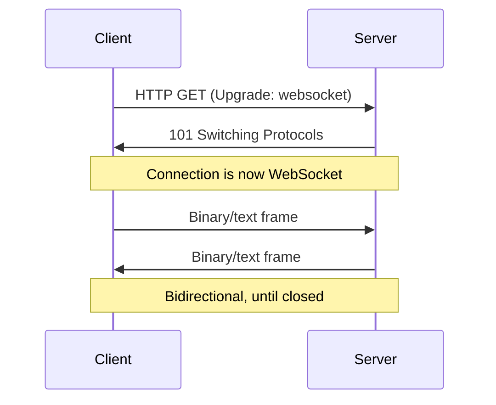

# WebSockets

A protocol providing a **persistent, full-duplex TCP connection** between client and server, enabling real-time bidirectional communication. Unlike HTTP's request-response model, WebSockets keep a single connection open for the lifetime of the session.

## How it works

WebSocket connections are bootstrapped via the HTTP upgrade mechanism — no new TCP connection is needed:

1. Client initiates a WebSocket handshake over HTTP (backed by an existing TCP connection)
2. Server responds with `101 Switching Protocols`; the TCP connection is handed off to WebSocket
3. Both sides send frames (text or binary) freely in either direction
4. Connection stays open until either side explicitly closes it

## Key properties

| Property | Value |
|---|---|
| Transport | TCP |
| Direction | Full-duplex (both sides send simultaneously) |
| Initiation | HTTP upgrade (reuses TCP connection) |
| State | Persistent (stateful) |
| Latency | Low — no per-message connection overhead |

## When to use

- **Live dashboards and feeds** — stock tickers, sports scores, analytics
- **Collaborative tools** — shared document editors, whiteboards
- **Chat and notifications** — any push-to-client pattern
- **Gaming** — real-time state sync

## Comparison with alternatives

| Protocol | Direction | Persistent | Notes |
|---|---|---|---|
| HTTP polling | Client→Server | No | Simple but wasteful |
| Server-Sent Events (SSE) | Server→Client only | Yes | Good for one-way push |
| WebSockets | Bidirectional | Yes | Best for interactive real-time |
| [[Distributed Systems/WebRTC\|WebRTC]] | Peer-to-peer | Yes | No server relay; UDP-based |
| [[Distributed Systems/gRPC\|gRPC]] | Bidirectional stream | Yes | Internal services; binary |

See also: [[Distributed Systems/index|Distributed Systems]]
