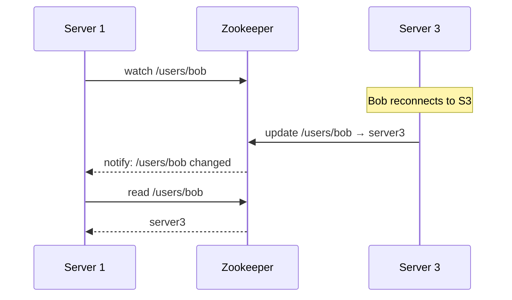

# Apache Zookeeper

A distributed coordination service that solves fundamental distributed systems problems: service discovery, configuration sharing, failure detection, leader election, and distributed consensus — in a single, consistent system.

## The coordination problem

A single-server system is simple: the server knows what is connected and where everything is. As you scale to multiple servers, coordination becomes hard:

- A **database** for server–user mappings adds latency and becomes a single point of failure.
- A **cache** can go stale when users reconnect to different servers, causing messages to be lost.
- **Server-to-server heartbeats** create O(n²) network traffic and suffer from [[CAP Theorem|partition tolerance]] issues — a live server may not respond to pings due to a transient network split.

Zookeeper replaces all these ad-hoc solutions. When a server comes online it registers in Zookeeper; when a user connects, the mapping is stored there. Interested servers receive automatic notifications about changes.

## Data model: ZNodes

Zookeeper organises data as a **hierarchical tree** of nodes called ZNodes — similar to a filesystem. Each ZNode stores coordination metadata and is addressed by a path (e.g., `/app/config`). ZNodes are not for bulk data.

| Type | Lifetime | Use case |
|------|----------|----------|
| **Persistent** | Until explicitly deleted | Config values, rate limits, feature flags |
| **Ephemeral** | Until the creating session ends | Tracking live servers, online users |
| **Sequential** | Until deleted; name gets auto-incrementing suffix | Leader election, distributed locks, message ordering |

## Ensemble and server roles

Zookeeper runs as an **ensemble** — an odd number of servers (e.g., 3 or 5) to support majority decisions.

- **Leader**: processes all write requests. Only one leader at a time.
- **Followers**: replicate the leader's state; serve read requests locally.

An ensemble tolerates `(n-1)/2` failures. A 5-node ensemble stays available with 2 servers down.

## Watches: event-driven notification

Clients set a **watch** on a ZNode. When that ZNode changes, Zookeeper notifies the watching client exactly once. This eliminates polling and server-to-server gossip.

## Key capabilities

### Configuration management

Store config in a ZNode (e.g., `/chat-app/config/enable_reactions`). Update it once; all watching services receive a notification and update their behaviour without restarting.

### Service discovery

Services register themselves as ephemeral ZNodes when they start and disappear automatically on failure. Consumers watch the service directory to get a live list of available instances — no health-check polling required.

### Leader election

Uses sequential ephemeral ZNodes:

1. Each candidate creates a sequential node under a shared path.
2. The node with the **lowest sequence number** is the leader.
3. All others watch the node with the next-lower number.
4. When the leader fails, its ephemeral node disappears and the next candidate is notified.

### Distributed locks

Same sequential ephemeral pattern as leader election:

1. Each client creates a sequential ephemeral node under a lock path.
2. The client with the lowest sequence number holds the lock.
3. Each other client watches only the node immediately below it (avoiding herd effect).
4. On release or crash, the node disappears and the next client is notified.

## Interview notes

- Zookeeper is an **infrastructure dependency** — bring it up when a design needs coordination (leader election, service registry, distributed locks) and you want a battle-tested solution rather than rolling your own.
- It is **not a general-purpose database** or cache.
- Modern alternatives include **etcd** (used by Kubernetes) and **Consul**, which offer similar primitives with simpler operational models.
- Mention the ensemble size and fault tolerance: a 3-node ensemble tolerates 1 failure; 5-node tolerates 2.

## Connected concepts

- [[Distributed Primitives]] — consistent hashing, gossip, bloom filter; Zookeeper adds coordination on top
- [[Kafka]] — Kafka originally used Zookeeper for broker coordination and leader election (now replaced by KRaft in newer versions)
- [[CAP Theorem]] — Zookeeper is CP: it prioritises consistency and partition tolerance over availability
