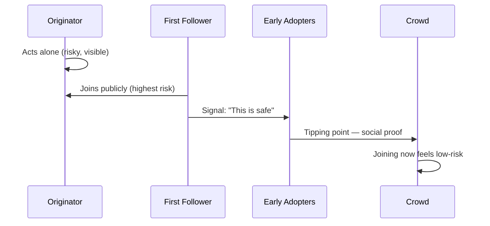

# First Follower

A principle from [[entities/Derek Sivers]]' TED talk "How to Start a Movement" (2010). The first person to follow a lone innovator is more important than the originator: they transform a "lone nut" into a leader and make it socially safe for others to join.

## The observation

Sivers analyzes footage of a man dancing alone at an outdoor festival. Key moments:

1. **Lone dancer** — ridiculed or ignored; "the lone nut"
2. **First follower joins** — treats the originator not as a nut but as a leader; publicly validates the behavior
3. **Second and third followers** — now it looks like a movement, not a single eccentric
4. **Tipping point** — new joiners aren't following the originator; they're following the crowd; social proof takes over

## Why the first follower is crucial

The originator has nothing to lose — they're already acting. The first follower takes a genuine social risk: visibly associating with behavior that might be mocked. That risk is what gives the signal its power. The first follower:

- Validates the originator's behavior as worthy of participation
- Removes the social cost of joining for subsequent followers
- Reframes the originator's role from eccentric to leader

## Implications for leadership

- **Nurture your first followers** — they deserve more credit than the originator
- **Be a first follower yourself** — supporting someone else's good idea is a form of leadership
- **Don't try to be the originator of everything** — finding worthy movements to join is as valuable as starting them
- **Movements need public, visible early adoption** — private support does not lower the social cost for others

## Related concepts

- [[Make Little Bets]] — testing whether an idea can attract first followers before scaling
- [[Career Capital]] — being the first follower of an emerging important skill or field can accumulate significant capital
- [[Skill Stacking]] — early adoption of an emerging discipline before it becomes competitive

## Referenced in

*How Google Works* (Eric Schmidt), *Essentialism* (Greg McKeown), *Essential Guide to Getting Your Book Published*, *Generation Hope*, *Anchored*, *This Is Strategy* (Seth Godin). Full list: [[summaries/sive-rs-ref]].
