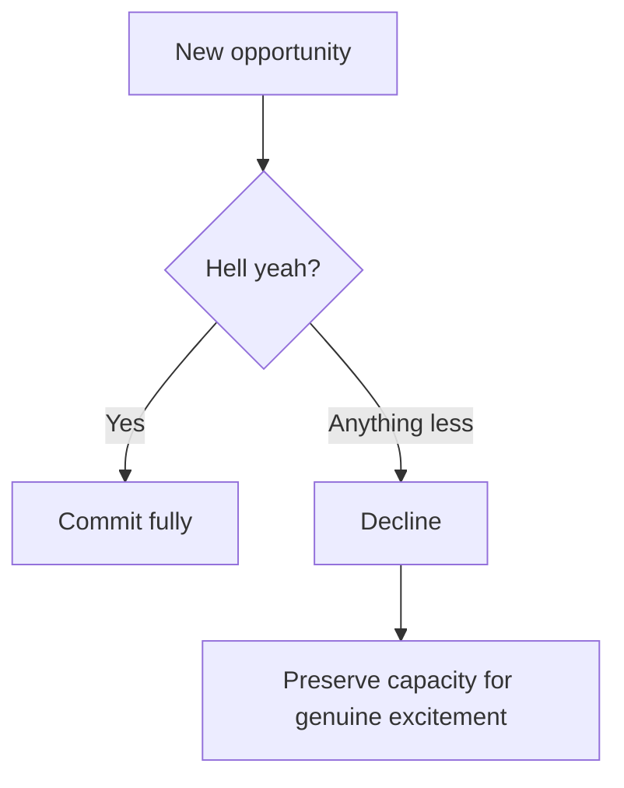

# Hell Yeah or No

A binary decision filter for evaluating opportunities and commitments, coined by [[entities/Derek Sivers]]. The rule: if your reaction to an opportunity is anything less than "hell yeah!", the answer is no.

## The rule

> "If something isn't a 'Hell Yeah!' — then it's a No."

The filter eliminates the lukewarm "yes" — the commitment made out of obligation, social pressure, or mild interest rather than genuine excitement. It assumes that:

1. You have enough opportunities that you can afford to decline anything short of excellent.
2. The cost of weak commitments is high: they consume time, dilute focus, and crowd out the "hell yeah" opportunities.
3. A mediocre yes is not neutral — it is actively harmful.

## Why it works

Most commitments feel acceptable when evaluated in isolation. The filter forces comparison: not "is this fine?" but "is this so exciting it deserves my limited time?" This reframe makes the mediocre cost visible.

## When to apply it

- Evaluating new projects, jobs, or collaborations
- Responding to social invitations when bandwidth is scarce
- Deciding whether to continue a current commitment (reapply periodically)

## Limits and nuances

- Does not apply well to obligations (parenting, urgent repairs) or situations where no option is exciting — sometimes you must choose the least-bad option.
- Can be misused to justify avoidance of worthy but difficult work. The filter targets *optional* commitments, not hard work that feels effortful rather than exciting.
- Greg McKeown's [[Essentialism]] restates this as: "If it isn't a clear yes, then it's a clear no."

## Related concepts

- [[Decisions vs Outcomes]] — complementary: once you commit via Hell Yeah, evaluate the decision on reasoning quality, not outcome
- [[Prioritization as a Knapsack Problem]] — the "knapsack" framing explains *why* weak commitments are costly: they consume capacity that could hold high-value items
- [[Commitment Fallacy]] — the failure mode that Hell Yeah or No prevents: rushing to commit before understanding
- [[entities/Derek Sivers]] — originator; featured in *Hell Yeah or No* (book) and widely cited
