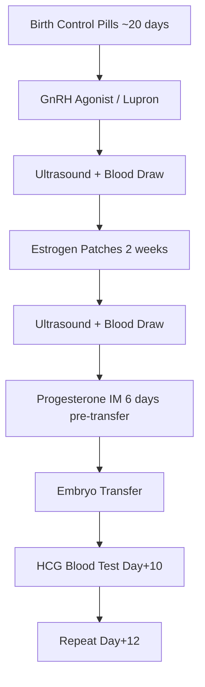

# Frozen Embryo Transfer Protocols

The two main protocols for a Frozen Embryo Transfer (FET) cycle. Both aim to prepare the uterine lining for embryo implantation; they differ in whether ovulation is suppressed or allowed to occur naturally.

## Two protocol types

| Protocol | Ovulation | Hormone source |
|----------|-----------|----------------|
| [[#Programmed FET Cycle]] | Suppressed | Exogenous estrogen + progesterone |
| [[#Ovulatory FET Cycle]] | Natural | Endogenous hormones |

---

## Programmed FET Cycle

The most common protocol. The natural cycle is suppressed and hormones are administered externally.

### Phase 1 — Ovarian Suppression

1. **Birth control pills** for ~20 days: prevent ovulation, regulate cycle timing.
2. **Lupron (Leuprolide acetate)** injection after ~2 weeks of BCPs.
   - A **GnRH agonist**: suppresses the pituitary gland, preventing natural LH/FSH surges from interfering with the controlled buildup of the endometrial lining.

### Phase 2 — Endometrial Development

3. **Ultrasound + blood draw**: confirm ovaries are quiet and uterine lining is thin.
4. **Estrogen patches**: applied every other day, dose escalated over 2 weeks. Goal: thicken the endometrium to >8mm.
5. **Second ultrasound + blood draw**: confirm lining thickness. May extend estrogen phase if needed.

### Phase 3 — Luteal Phase Support

6. **Progesterone intramuscular injections**: begin 6 days before transfer. Continued daily for 10 weeks if pregnancy is confirmed.

### Phase 4 — Transfer

7. **Embryo transfer**: arrive 30 minutes early with a full bladder. Procedure takes ~10 minutes.
8. **Recovery**: limit activity day-of and day-after. Resume normal activity after 3 days.

### Phase 5 — Pregnancy Confirmation

9. **HCG blood test**: 10 days post-transfer, repeated 2 days later to confirm doubling (indicates viable pregnancy).

---

## Ovulatory FET Cycle

Uses the patient's natural ovulation to time the transfer, without suppression medications. Less medication burden, but requires closer monitoring to identify the precise ovulation window.

*This page is a stub — expand as more notes are captured.*
