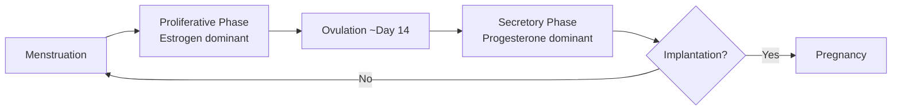

# Menstrual Cycle (IVF Context)

Understanding the menstrual cycle is foundational to IVF because the treatment protocols simulate and manipulate the natural hormonal cycle to prepare the uterus for embryo transfer.

## Hormonal regulation

Two hormones dominate the cycle:

- **Estrogen**: dominates the first half. Drives endometrial thickening. Also maintains vaginal health, bone density.
- **Progesterone**: dominates the second half. Prepares the lining for implantation, supports pregnancy, reduces uterine contractions.

Together they control timing of ovulation and trigger menstruation if pregnancy does not occur.

## Two phases of the endometrium

### Proliferative Phase (Follicular Phase) — Days ~4–14

- Driven by rising estrogen from developing ovarian follicles.
- The [[#Endometrium]] thickens and regenerates after the previous menstruation.
- Glands elongate and become more curved.
- Purpose: prepare the lining for potential implantation.

### Secretory Phase (Luteal Phase) — Days ~14–28

- Also called the luteal phase. Begins after ovulation.
- Progesterone takes over and further matures the uterine lining.
- Endometrium becomes more receptive to implantation.
- Increased blood flow; uterine secretions increase.
- Lasts until the start of the next period (or is maintained by progesterone supplementation in IVF).

## Endometrium

The innermost layer of the uterus — the target for embryo implantation.

**Two layers:**
- *Basal layer*: stem cells; regenerates the functional layer; remains constant throughout the cycle.
- *Functional layer*: adjacent to the uterine cavity; undergoes cyclic changes in response to hormones; shed during menstruation.

**Functions:**
- Thickens and becomes vascular to prepare for implantation (goal in FET: >8mm).
- If fertilization occurs, transforms into the decidua to support the fetus.
- Shed during menstruation if no pregnancy.

**In IVF**: estrogen patches thicken the endometrium during FET preparation. Ultrasound confirms thickness before transfer proceeds.

## Endometriosis

A chronic estrogen-dependent condition where endometrial-like tissue grows outside the uterus. Relevant in IVF because it can affect implantation success and may require specific protocol adjustments.

## Regulating the cycle for IVF

IVF protocols deliberately control the menstrual cycle phases:
- Estrogen patches simulate the proliferative phase and thicken the lining.
- Progesterone injections simulate the secretory phase and time the "window of implantation."
- GnRH agonists (Lupron) suppress the pituitary to prevent natural hormonal interference.

See [[IVF/Frozen Embryo Transfer Protocols]] for the full protocol sequence.
