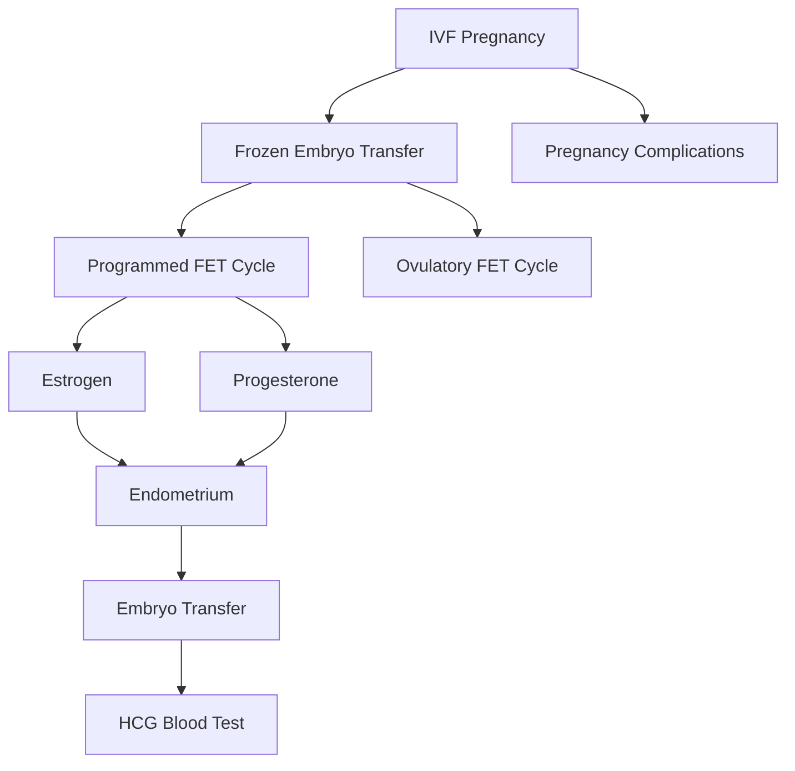

# IVF (In Vitro Fertilization)

Overview of IVF-related concepts captured from personal notes during a fertility treatment journey.

## Sub-pages

- [[IVF/Menstrual Cycle]] — hormonal regulation, proliferative and secretory phases, estrogen/progesterone roles
- [[IVF/Frozen Embryo Transfer Protocols]] — programmed FET cycle, ovulatory FET cycle, step-by-step procedures
- [[IVF/IVF Pregnancy Complications]] — placenta previa, preeclampsia, vasa previa, placenta issues, heart echo

## Key concepts at a glance

## Hormones & anatomy

| Term | Role |
|------|------|
| [[IVF/Menstrual Cycle#Estrogen\|Estrogen]] | Drives proliferative phase; thickens endometrial lining |
| [[IVF/Menstrual Cycle#Progesterone\|Progesterone]] | Drives secretory phase; supports implantation and pregnancy |
| [[IVF/Menstrual Cycle#Endometrium\|Endometrium]] | Uterine lining; the target tissue for embryo implantation |
| GnRH Agonist (Lupron) | Suppresses pituitary to prevent interference during cycle preparation |
| HCG | Pregnancy hormone measured 10 days post-transfer |
