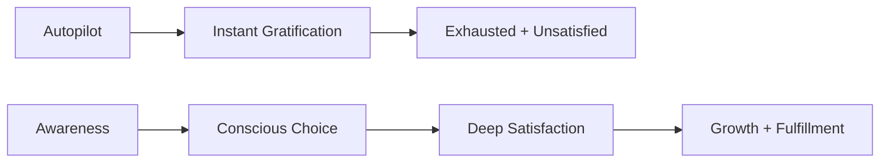

# Instant Gratification vs Deep Satisfaction

Two modes of reward the brain pursues — one cheap and immediate, one costly and lasting. The brain defaults to the cheap one.

## Instant gratification

Small, quick dopamine hits: scrolling social media, checking email, browsing Reddit. Each micro-reward is real but hollow. After an hour of this:
- Feels exhausting despite minimal exertion.
- Leaves no sense of accomplishment.
- Feeds [[Information Overload]] and [[Decision Fatigue]].

This is [[Mental Junk Food]] — stimulating but not nourishing.

## Deep satisfaction

The feeling after working hard on something meaningful and finally understanding it — when something clicks and fits the mental model. Activities that provide it: deep reading, creative work, building something, solving a hard problem, playing an instrument.

Characteristics:
- Requires sustained effort and often initial discomfort.
- Produces lasting sense of accomplishment.
- Aligns with longer-term values and growth.

## The battle

The brain gravitates toward instant gratification because it is easier — this is [[Our Defaults|the default state]]. We [[We Run on Autopilot|run on autopilot]], and the autopilot reaches for the dopamine hit.

The split-second before engaging with something instant-gratifying is where [[Awareness]] lives. Saying no in that moment — repeatedly — is what shifts the default over time.

## The pattern

The goal: make deep satisfaction the default, not the exception. See [[Awareness]] for how.
