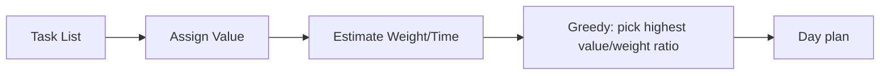

# Prioritization as a Knapsack Problem

A mental model for task scheduling: your day is a knapsack with limited capacity (time), and tasks are items with weight (time cost) and value (impact). The goal is to maximize value given the constraint.

## The knapsack analogy

The [Knapsack Problem](https://en.wikipedia.org/wiki/Knapsack_problem) is a classic optimization problem: given a bag with limited capacity and a set of items each with a weight and a value, choose items to maximize total value without exceeding capacity.

Applied to daily life:
- **Capacity** = available hours in the day.
- **Items** = tasks on your list.
- **Weight** = time each task requires.
- **Value** = impact or importance of completing the task.

Since you can never do everything, the greedy approach — pick highest-value tasks first — is the rational strategy.

## Priority is time

[[Priorities are Time-Bound]]: a task's value is almost always a function of *when* it must be done. A higher-priority task means it must be done sooner, not just that it matters more in the abstract. The urgency and the value are correlated — so priority order and time-value order tend to align.

This reframes priority: it is not just an abstract ranking but a statement about *when the task expires* or diminishes in value.

## Practical application

You cannot perfectly solve the knapsack problem (it is NP-hard), but the greedy approximation — pick by value-to-time ratio — is a strong heuristic for daily scheduling.
