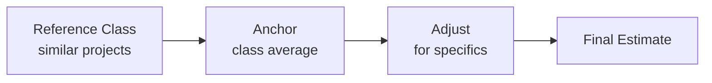

# Reference Class Forecasting

An estimation method: look at the average outcome of similar past projects (the *reference class*) and use that average as your baseline estimate, then adjust for factors specific to your project.

From *How Big Things Get Done*.

## The process

### Step 1: Anchor

The **anchor** is your initial estimate — the class average. Find projects similar in scope, domain, and complexity to yours, and take the average of how long they took or what they cost. This grounds your estimate in empirical reality rather than optimistic intuition.

### Step 2: Adjust

Once you have an anchor, **adjusting** means modifying it up or down based on factors specific to your project that meaningfully differ from the class average. A new team member might add time; exceptional tooling might subtract it.

**Important**: adjustments require a prior anchor. You cannot adjust in a vacuum. Start with the class average, then deviate with justification.

## Why it works

Human intuition about project timelines is notoriously optimistic (planning fallacy). Reference class forecasting replaces the inside view ("this project feels like 3 weeks") with an outside view ("projects like this typically take 6 weeks"). The adjustment step then handles legitimate specifics without abandoning empirical grounding.

## Relationship to project planning

Reference class forecasting pairs naturally with the [[Think Slow Act Fast]] approach: think slowly to gather the reference class data and adjust carefully, then execute quickly with a realistic timeline.
