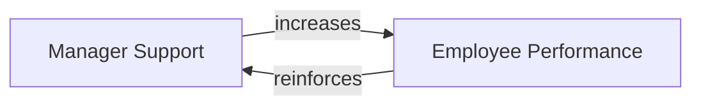

# Reinforcing Loop

A feedback loop that **amplifies change in one direction** — the more of something you have, the more you get (or the less you have, the less you get). Also called a positive feedback loop or virtuous/vicious cycle depending on direction.

## Mechanism

A change in variable A leads to a change in B, which feeds back to further change A in the same direction. The loop accelerates itself.

## Examples

- Supportive manager → better employee performance → manager invests more support.
- More savings → more investment → more returns → more savings.
- Vicious cycle: poor performance → criticism → demoralization → poorer performance.

## Relationship to [[Balancing Loop]]

Reinforcing loops do not run forever. At some point a [[Balancing Loop]] enters — a constraint or corrective force that limits runaway amplification (e.g., burnout caps the performance-support spiral). Real systems almost always contain both.

See also: [[Systems Thinking]]
