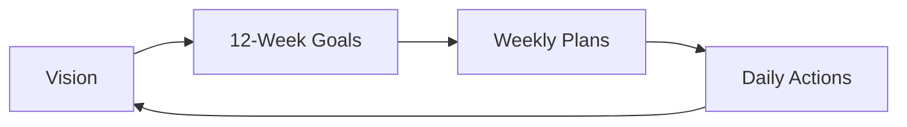

# Vision

A long-term north star — not a specific endpoint to reach, but a mode of living to sustain every day. Vision is beyond the horizon; it should not be something achievable in a year or two.

## What vision is not

- A project goal (those belong to [[Goal Setting]] and the [[12 Week Year]]).
- A milestone ("get promoted by 40").
- A to-do item.

## What vision is

A set of principles or ways of being that guide all shorter-term decisions. Example visions from personal notes:

- **Live with integrity, sincerity, and courage** — own up to responsibility, express opinions bravely, don't follow the herd, search for truth.
- **Always be learning** — maintain curiosity, apply new learning, don't just accumulate passive knowledge.
- **Reason from first principles** — draw your own conclusions from fundamentals rather than inheriting others' conclusions.
- **Be confident and believe in yourself** — the gap between "thinking you can" and "knowing you can" matters; lean toward the latter.

## Role in planning

Vision gives [[Goal Setting]] its direction. The [[12 Week Year]] framework explicitly requires that 12-week goals be in alignment with long-term vision — otherwise you optimize a sprint in the wrong direction.

Daily actions should compound toward vision, not just toward the nearest deadline.
