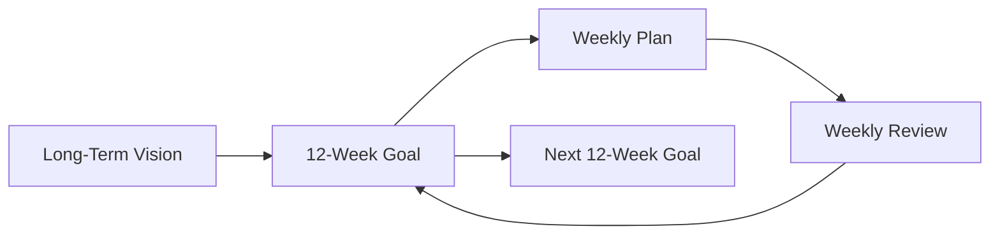

# 12 Week Year

Book by Brian P. Moran. Core idea: replace annual planning with 12-week execution cycles, each treated as a full "year."

## Key ideas

- **Annual planning is unreliable** — humans are poor at predicting what will happen over 12 months, and the long horizon encourages complacency.
- **New Year enthusiasm decays fast** — motivation spikes at the start of the year, then drops as the year stretches ahead with "plenty of time left."
- **Q4 anxiety is the symptom** — cramming and stress in the final quarter reveal that the annual cycle fails most people.
- **12-week cycles** compress urgency into a manageable window. You run this cycle four times a year, giving four chances to re-evaluate and course-correct.
- **Goals must link to long-term [[Vision]]** — without alignment to where you want to be in years, the 12-week sprint optimizes the wrong things.
- **Weekly plans are essential** — after setting a 12-week goal, break it into weekly milestones so you catch drift early, not at week 11.

## Planning rhythm

## Why it matters

Treats every 12-week block as a complete performance year, creating the psychological urgency of a deadline without the anxiety of an annual crunch. Pairs naturally with [[Goal Setting]] and [[Vision]].
